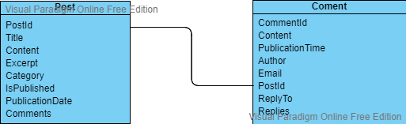

# The basics

The real base of any blog are the posts, without those it would not really be a blog. To organize the blog categories are often used, so any post should belong to a category or multiple categories. Some blogs use tags to further organize the blog, or make searching the blog for a post easier. Apart from the posts, visitors should be able to leave a comment on a post. This means a post could have comments attached to it. Some blogs allow for replies to these comments, this is done to aid the discussion and to group comments belonging together.

Just to be clear, at this point, any worries about how to store any data is premature. For now the focus is on building the models. Deciding how to store the data can be done later. For now, the task is deciding what the models will look like.

## Models

Before deciding what the model will look like, som decisions need to be made. these will determine what the model will look like, but might also impact the functionality of the blog. So careful consideration is key!

What decisions are to be made? A quick overview of all the questions followed by the decision:

- Use one category for each post or allow multiple categories per post? On category per post, to start this seems reasonable and it will not be to big of an issue to allow multiple categories further down the road, if need be.
- Allow the use of tags? For the sake of simplicity, no. This feels like unnecessary at the start. It would be real simple to add this feature later.
- Comments? Comments are always useful, they can spark interesting discussion on the topic. So yes comments should be implemented from the start.
- Should there be a possibility to reply to a comment? If the goal is to encourage discussion, replies should be implemented to group the discussion. This will allow for the discussion to remain grouped and not dispersed over multiple comments that are not necessarily grouped. This means replies will be implemented.

The decisions are in, now the models can begin to take shape.

### Post

The most obvious model to build is the "Post" model. This model will contain all properties of a blog post. Running through the properties:

- PostId: a unique identifier for the post. It might feel odd to add this because the blog is intended not to use any sort of relational database. But including this identifier will provide the possibility to late switch to a DBMS, so including this property makes the solution more future proof.
- Title: a title for the post, obviously any post requires a title.
- Content: a blog post without any content would not really be a blog post.
- Excerpt: in a list of blog posts, the first few lines are shown. this property should support this.
- Category: Just a string with a category. In some cases, it might be handy to build a separate model to hold category definitions, but in this case simplicity is key and the category can be stored as a string property.
- IsPublished: a switch indicating the post is published and accessible to the readers of the blog. This will allow for the author to work on posts without making them accessible right away.
- PublicationDate: a property holding the date the post was published. This is valuable information for the readers of the blog as it helps to determine if the content is still current.
- Comments: a list of comments for the post. A comment will have its own model.

### Comment

A comment is linked to a blog post, as it is comment on the post. But a comment could also be linked to another comment, making it a reply to that comment. This would, in theory, allow for replying to a reply and allow this to go on indefinitely, the UI should make sure the depth of these replies is limited. Listing the properties for a comment:

- CommentId: once again a unique identifier for a comment. The same remark as the remark made for the PostId is valid here.
- Content: The content of the comment.
- PublicationTime: The timestamp on which the comment was posted.
- PostId: a reference to the post this comment is linked to.
- ReplyTo: a reference to the CommentId this comment is a reply for. This Property is used to be able to link replies to the original comment.
- Replies: A list of replies. this list will contain Comments that are replies to this comment.
- Author: The name of the author of the comment. It's always nice to be able to identify the person leaving the comment. This might be an optional field, so anonymous comments are allowed
- Email: The email address of the author of the comment. It might come in handy to have this, if the author is willing to share.

## Wrapping up

To wrap up, a small visualization of the model (created using [visual paradigm online](https://online.visual-paradigm.com/)):

programming these models is fairly straight forward, creating two simple classes (preferably in the models folder of the solution), and adding the properties as discussed above.

Next time: thinking about data access...
